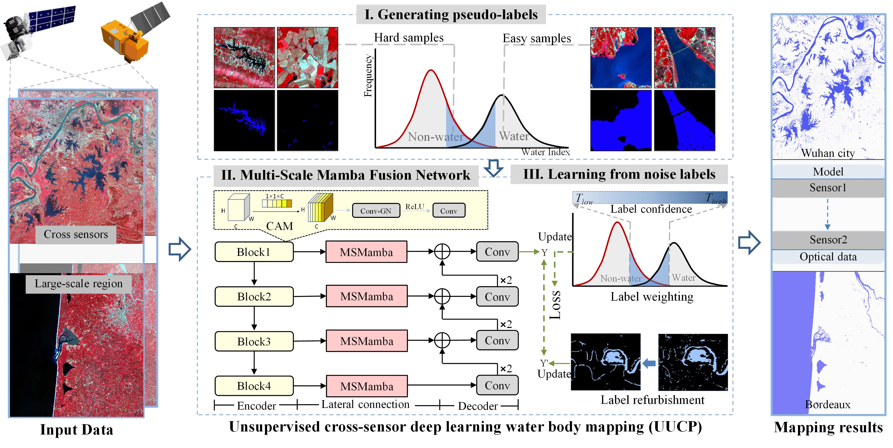

# Large-scale mapping of water bodies across sensors using unsupervised deep learning

This is an official implementation of UUCP framework in our RSE 2025 paper "Large-scale mapping of water bodies across sensors using unsupervised deep learning".

We hope that the UUCP framework can serve as a stronger and clearer baseline for future unsupervised water extraction research.
# Getting Started
## Generating pseudo-labels
```
python3 generate_pseudo_label.py 
```
### Requirements:
* python == 3.7
* OS environment == Windows

## Train 
```
python3 Train.py
```
### Requirements:
* python == 3.8.19
* pytorch == 2.2.2
* mamba-ssm == 2.0.3
* gdal == 3.6.2

## Test 
```
python3 test.py
```

## Citation
If you find it useful, please consider citing:
```
@article{ZHAO2025114877,
title = {Large-scale mapping of water bodies across sensors using unsupervised deep learning},
author = {Ji Zhao and Pu Xiao and Yuting Dong and Christian Geiß and Yanfei Zhong and Hannes Taubenböck},
journal = {Remote Sensing of Environment},
year = {2025},
}
```
